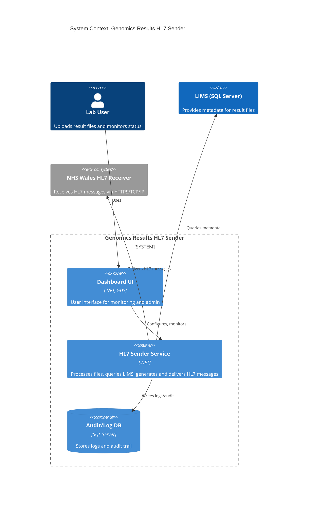
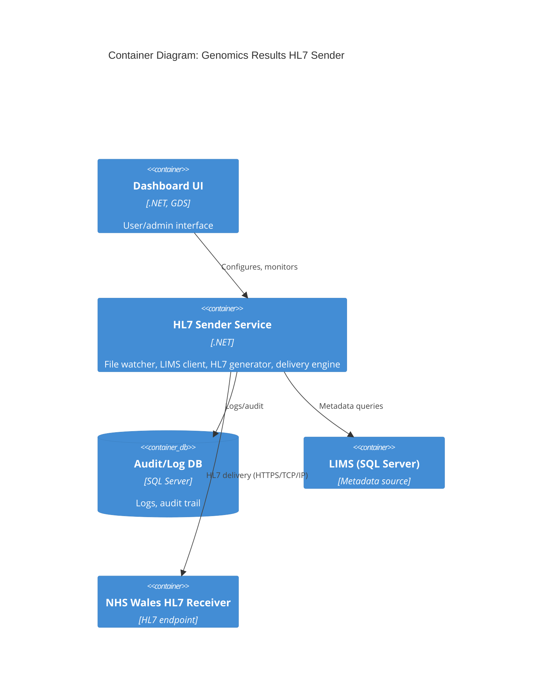
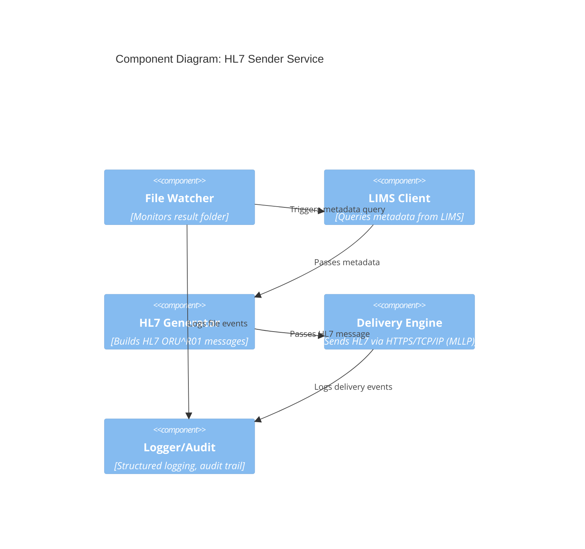

---
title: Architecture Design - C4 Model for Genomics Results HL7 Sender
date_created: 2025-08-21
owner: Genomics-Partnership-Wales
tags: [architecture, C4, diagram, DDD, .NET, HL7]

This specification provides a C4 model architecture diagram and description for the Genomics Results HL7 Sender. The C4 model clarifies the system's context, containers, components, and key relationships for developers, architects, and stakeholders.

## 1. Purpose & Scope

To visually and textually describe the system architecture using the C4 model, supporting implementation, onboarding, and review. Intended for technical and non-technical stakeholders.

## 2. Definitions

## 3. Requirements, Constraints & Guidelines

## 4. C4 Model Diagrams & Descriptions

### 4.1 Context Diagram

### 4.2 Container Diagram

### 4.3 Component Diagram (HL7 Sender Service)

## 5. Acceptance Criteria

## 6. Test Automation Strategy

## 7. Rationale & Context

The C4 model provides a clear, layered view of the system, supporting maintainability, onboarding, and compliance.

## 8. Dependencies & External Integrations

## 9. Examples & Edge Cases

## 10. Validation Criteria

## 11. Related Specifications / Further Reading

